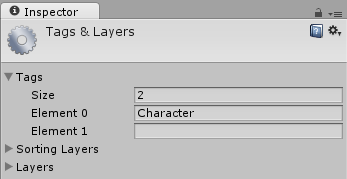
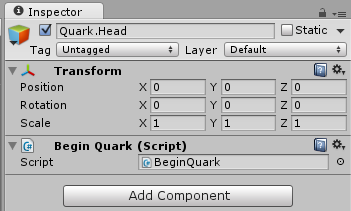

Quark Usage
====
You can start using Quark in 2 steps:

+ Include the framework
+ Prepare your scene

Inclusion
----
If you have downloaded the source of Quark, first you should build the source. (this is more likely)
Quark is developed using either `Monodevelop 5.*` (on Linux) or `Visual Studio 2013` (on Windows), with `.Net Framework 2.0`, and without any external dependencies (except `UnityEngine.dll`, which is included in the source).
Simply build the project using either an IDE, or from command line (msbuild or mdtool).
After that, simply copy the produced `Quark.dll` file to your Unity projects, Assets folder.

If you have the Unity Asset file, simple double click on it, Unity will take care of everything for you.

Preparing the scene
----
Alright, after including the framework, we should set up our Unity scene to work with Quark.
First, there must be an object on the scene which starts Quark routines. The object itself is very small and does not have to be doing anything, it should just create the `Head` component on itself on running.
Also Quark does not take responsibility for all of your `GameObject` instances on a scene. For example, your static objects should not be controlled by Quark. 
And there are some properties that should be present for an object to controlled by Quark, like identifiablity or targetability.
This requirements can be easily solved by using a `Targetable` or `Character` component on the required objects.

But for some reason, if you just drag-drop the Components provided from `Quark.dll`, they will work right away as you expect, but after restarting Unity, they will break. I am not sure why this behavior occurs, but I found a simple solution: tag objects you want Quark to handle with something, and let an additional script add the components before everything. Also it should add the `Head` component to itself.

First create a new Tag, I use `Character` as a tag too.



So, just create a new script, say `BeginQuark.cs` with the following content:

```csharp
using UnityEngine;
using System.Collections;
using Quark;
using Quark.Utilities;

public class BeginQuark : MonoBehaviour
{
    void Awake()
    {
	    //Add the Quark.Head component to this object
        gameObject.AddComponent<Head>();
        //Add Character component to every object tagged with Character
        foreach (GameObject character in GameObject.FindGameObjectsWithTag("Character"))
            character.AddComponent<Character>();
        //Only Warnings and Errors will be shown on the Debug console
        Logger.Level = LogLevel.Warn;
    }
}
```
This is a distaste but I hope to fix it in a short time with a more 'convenient' way rather than tagging objects.

Next, create an empty `GameObject` in your hierarchy (by pressing `Ctrl + Shift + N` and add a`BeginQuark` component to it.



That's it, now you are ready to use Quark with your projects.

----
I recommend continuing with this article: [Introduction to Quark][1]

[1]: Introduction.md
